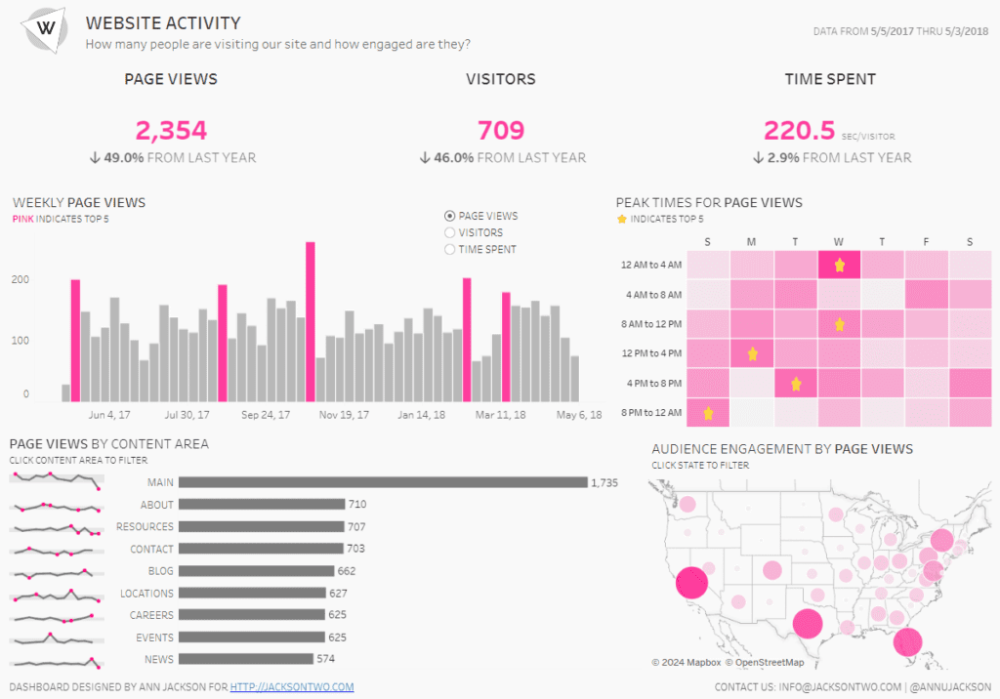
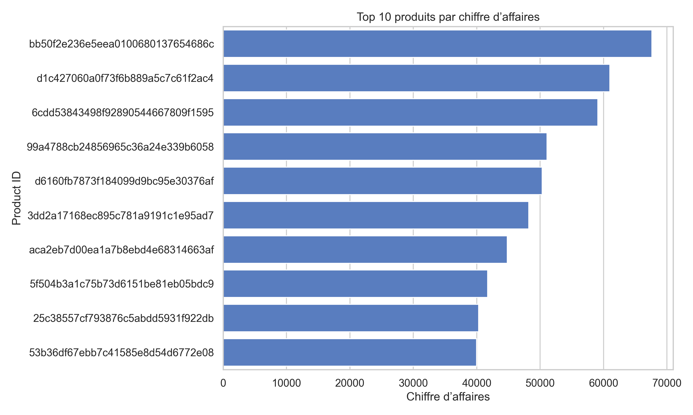

# HIRECH-Profile  
# 💫 À propos de moi :
Je travaille actuellement sur un projet Data lié aux ventes e-commerce.  
Je cherche à collaborer sur des projets en Data et en IA.  
Je recherche de l’aide sur le Machine Learning et AWS.  
J’apprends actuellement le MLOps.  
N’hésite pas à me poser des questions sur mon profil.  
Fun fact : mon code est plus stable que mon sommeil..
Petite précisions les visues Power BI sont pas liés au notebook c'est des projets à part j'ai choisis Mes 4 projets phares en Data & IA

## 🌐 Réseaux sociaux :

# 💻 Stack technique :
                                                

# 📊 Portfolio :
  
  

### 📊 Visualisation Power BI / Tableau 
  

### 📊 Les Notebooks / Projets

- **Ecommerce AI**  
  [Voir le projet complet](src/02_EDA_Data_Visualization.ipynb)

- **NLP Chatbot**  
  [Voir le projet complet](src/02_EDA_Data_Visualization.ipynb)

- **Recommender System**  
  [Voir le projet complet](src/02_EDA_Data_Visualization.ipynb)

- **Computer Vision App**  
  [Voir le projet complet](src/02_EDA_Data_Visualization.ipynb)

### ✍️ Citation aléatoire de développeur

### 📄 Mon CV

[📥 Télécharger mon CV en PDF](images/CV.pdf)

<!-- Fièrement créé avec GPRM ( https://gprm.itsvg.in ) -->
